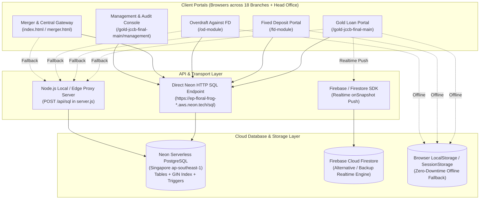
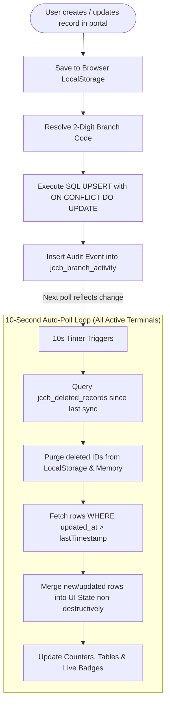

# The Junagadh Commercial Co-Operative Bank Ltd. (TJCCB)
# Complete Technical Reference: Database & Backend Architecture

---

## 1. High-Level Architecture Overview

The **JCCB Tools Suite** is a multi-branch core banking assist suite serving **18 physical branches** and a centralized **Head Office (Branch `99`)**. The architecture uses a **Zero-Data-Loss Hybrid Relational-Document Model** with real-time multi-device cloud synchronization.



---

## 2. Backend & API Communication Mechanics

The backend operates via a **multi-tiered transport protocol** designed to eliminate network latency, avoid CORS issues, and prevent data loss even under unstable branch connectivity.

### 2.1 Communication Channels

1. **Direct Neon HTTP Query API (`runNeonQuery` in `postgres-sync.js`)**:
   - Browser clients make direct HTTPS `POST` requests to Neon's HTTP SQL endpoint (`https://<neon-host>/sql`).
   - Neon processes arbitrary parameterized SQL statements with `application/json` payload containing `{ query: string, params: array }`.
   - Neon authenticates via the `Neon-Connection-String` header or SQL connection string.
   - **Advantage**: Zero intermediary server needed for cloud deployments (e.g. Vercel, static CDNs).

2. **Local / Serverless Node Proxy (`server.js` at `POST /api/sql`)**:
   - When running via the built-in Node server (`node server.js`), all requests to `/api/sql` are intercepted and forwarded to the Neon host.
   - Sets wildcard CORS headers (`Access-Control-Allow-Origin: *`) to ensure local development and intranet devices can query without browser CORS blockages.

3. **Client-Side Real-Time Fallback & Push Layer (`firebase-sync.js`)**:
   - Uses Firestore `onSnapshot` listeners to receive push notifications on collection modifications without waiting for polling intervals.

4. **Failover Execution Flow**:
   ```mermaid
   sequenceDiagram
       autonumber
       participant UI as Portal UI (Client)
       participant Sync as PostgresSync Engine
       participant Local as Browser LocalStorage
       participant Neon as Neon HTTP /sql
       participant Proxy as Node /api/sql Proxy

       UI->>Sync: syncGoldLoan(record)
       Sync->>Local: Persist copy to LocalStorage (Instant local cache)
       Sync->>Neon: POST https://host/sql (Direct Neon SQL)
       alt Neon Responds 200 OK
           Neon-->>Sync: Return JSON { rows, command }
           Sync-->>UI: Success Status (Green indicator)
       else Neon Request Fails / Network Timeout
           Sync->>Proxy: POST /api/sql (Fallback to Proxy)
           alt Proxy Responds 200 OK
               Proxy-->>Sync: Return JSON { rows, command }
               Sync-->>UI: Success Status
           else Both Fail
               Sync-->>UI: Queue locally, maintain offline status (Amber indicator)
           end
       end
   ```

---

## 3. Database Schema & Dual-Write Architecture

The database implements a **Hybrid Relational-Document Architecture**. Core lookup fields (Branch Code, Account/Loan Numbers, Customer Names, Dates, Amounts) are extracted into standard relational columns with B-Tree indexes, while the full input structure (including joint applicants, dynamic tables, appraisal matrices, nominee forms, and base64 photos) is stored inside a **PostgreSQL `JSONB` column**.

### 3.1 Primary Operational Tables

#### Table 1: Gold Loans (`public.jccb_gold_loans`)
Handles complete gold loan disbursements, appraisal schedules, 3-in-1 vouchers, and valuer records.

```sql
CREATE TABLE IF NOT EXISTS public.jccb_gold_loans (
    id               TEXT PRIMARY KEY,
    branch_code      TEXT NOT NULL,
    loan_no          TEXT,
    customer_name    TEXT,
    phone            TEXT,
    sanction_amount  NUMERIC,
    sanction_date    TEXT,
    status           TEXT DEFAULT 'ACTIVE',
    payload          JSONB NOT NULL,
    updated_at       TIMESTAMP WITH TIME ZONE DEFAULT NOW()
);

-- Indexes for performance
CREATE INDEX IF NOT EXISTS idx_gold_branch      ON public.jccb_gold_loans (branch_code);
CREATE INDEX IF NOT EXISTS idx_gold_loan_no     ON public.jccb_gold_loans (loan_no);
CREATE INDEX IF NOT EXISTS idx_gold_status      ON public.jccb_gold_loans (status);
CREATE INDEX IF NOT EXISTS idx_gold_updated     ON public.jccb_gold_loans (updated_at);
CREATE INDEX IF NOT EXISTS idx_gold_customer    ON public.jccb_gold_loans (customer_name);
CREATE INDEX IF NOT EXISTS idx_gold_payload_gin ON public.jccb_gold_loans USING GIN (payload);
```
* **Payload Structure**: `{ proposalNo, accountNo, branchCode, branchName, loanDate, customerId, customerName, fatherSpouseName, address, mobileNo, schemeName, sanctionAmount, interestRate, tenureMonths, totalValuation, totalGrossWeight, totalNetWeight, totalItems, valuerName, valuerId, ornaments: [...], processingFee, appraiserCharge, stampDuty, totalDeductions, netDisbursement, applicantPhoto, ornamentPhoto, status, createdAt, updatedAt }`

---

#### Table 2: Fixed Deposit Accounts (`public.jccb_fd_forms`)
Handles 4-page A4 application forms, multi-joint KYC, DA-1 nomination, and interest rate slab calculations.

```sql
CREATE TABLE IF NOT EXISTS public.jccb_fd_forms (
    id               TEXT PRIMARY KEY,
    branch_code      TEXT NOT NULL,
    form_no          TEXT,
    customer_name    TEXT,
    deposit_amount   NUMERIC,
    interest_rate    NUMERIC,
    tenure_months    INTEGER,
    status           TEXT DEFAULT 'COMPLETED',
    payload          JSONB NOT NULL,
    updated_at       TIMESTAMP WITH TIME ZONE DEFAULT NOW()
);

-- Indexes
CREATE INDEX IF NOT EXISTS idx_fd_branch      ON public.jccb_fd_forms (branch_code);
CREATE INDEX IF NOT EXISTS idx_fd_form_no     ON public.jccb_fd_forms (form_no);
CREATE INDEX IF NOT EXISTS idx_fd_status      ON public.jccb_fd_forms (status);
CREATE INDEX IF NOT EXISTS idx_fd_updated     ON public.jccb_fd_forms (updated_at);
CREATE INDEX IF NOT EXISTS idx_fd_customer    ON public.jccb_fd_forms (customer_name);
CREATE INDEX IF NOT EXISTS idx_fd_payload_gin ON public.jccb_fd_forms USING GIN (payload);
```
* **Payload Structure**: `{ formRefNo, formDate, branchName, branchCode, enteredBy, authorizedBy, firstCustomerId, firstFullName, firstRelativeName, firstDob, firstAge, firstGender, firstMobileNo, firstPan, firstAadharNo, firstAddress, second_applicant, third_applicant, fourth_applicant, typeOfAccount, typeOfDeposit, deposit1Amount, deposit1AmountWords, deposit1AmountWordsGuj, tenure, deposit1Roi, deposit1MaturityAmount, deposit1MaturityDate, seniorCitizenBenefit, nominee1Name, nominee1Relation, nominee1Age, nominee1Address, paymentMode, data: { ...all DOM fields } }`

---

#### Table 3: Overdraft Against FD (`public.jccb_od_loans`)
Handles OD credit limit sanctioning, Demand Promissory (DP) notes, Composite Letter of Lien (Clauses 1 to 9), and sanction memorandums.

```sql
CREATE TABLE IF NOT EXISTS public.jccb_od_loans (
    id               TEXT PRIMARY KEY,
    branch_code      TEXT NOT NULL,
    account_no       TEXT,
    customer_name    TEXT,
    limit_amount     NUMERIC,
    fd_receipt_no    TEXT,
    status           TEXT DEFAULT 'SANCTIONED',
    payload          JSONB NOT NULL,
    updated_at       TIMESTAMP WITH TIME ZONE DEFAULT NOW()
);

-- Indexes
CREATE INDEX IF NOT EXISTS idx_od_branch      ON public.jccb_od_loans (branch_code);
CREATE INDEX IF NOT EXISTS idx_od_acc_no      ON public.jccb_od_loans (account_no);
CREATE INDEX IF NOT EXISTS idx_od_status      ON public.jccb_od_loans (status);
CREATE INDEX IF NOT EXISTS idx_od_updated     ON public.jccb_od_loans (updated_at);
CREATE INDEX IF NOT EXISTS idx_od_customer    ON public.jccb_od_loans (customer_name);
CREATE INDEX IF NOT EXISTS idx_od_payload_gin ON public.jccb_od_loans USING GIN (payload);
```
* **Payload Structure**: `{ id, accountNo, branchCode, branchName, loanDate, status, loanPurpose, savingAccNo, applicant1: { id, name, address, mobile, pan, aadhaar }, jointApplicants: [...], loanAmount, loanAmountWordsGuj, loanAmountWordsEng, interestRate, marginPercent, drawingPower, fdReceipts: [{ certNo, accountNo, amount, roi, issueDate, maturityDate, maturityAmount, holderName, lienAmount, pledgedPercent }], demandPromissoryNote, letterOfLien, sanctionMemo, createdAt, updatedAt }`

---

### 3.2 Master & Telemetry Tables

| Table Name | Primary Key | Key Columns | Purpose |
| :--- | :--- | :--- | :--- |
| `jccb_gold_rates` | `id` | `date_str`, `rate`, `payload`, `updated_at` | Daily 22K/24K valuation rate board |
| `jccb_gold_branches` | `code` | `name`, `payload`, `updated_at` | Master catalog of 18 branches + Gujarati titles |
| `jccb_gold_valuers` | `id` | `name`, `payload`, `updated_at` | Registered gold appraisers repository |
| `jccb_gold_customers` | `id` | `name`, `phone`, `payload`, `updated_at` | Central customer registry |
| `jccb_gold_settings` | `key` | `payload`, `updated_at` | Bank-wide configurations & interest slab rules |
| `jccb_gold_sessions` | `id` | `branch_code`, `payload`, `updated_at` | Active device terminal presence & heartbeat |
| `jccb_deleted_records` | `id` | `record_id`, `table_name`, `branch_code`, `deleted_by`, `deleted_at` | Cross-device deletion tombstone ledger |
| `jccb_branch_activity` | `id` | `branch_code`, `module`, `action`, `record_id`, `summary`, `created_at` | Comprehensive audit trail & security log |

---

### 3.3 Database Triggers & CDC Mechanism

To keep timestamps precise across concurrent branch edits without trusting client clock skews, PostgreSQL triggers are attached to every table:

```sql
CREATE OR REPLACE FUNCTION jccb_set_updated_at()
RETURNS TRIGGER AS $$
BEGIN
    NEW.updated_at = NOW();
    RETURN NEW;
END;
$$ LANGUAGE plpgsql;

CREATE TRIGGER trg_gold_loans_updated_at
    BEFORE UPDATE ON public.jccb_gold_loans
    FOR EACH ROW EXECUTE FUNCTION jccb_set_updated_at();

CREATE TRIGGER trg_fd_forms_updated_at
    BEFORE UPDATE ON public.jccb_fd_forms
    FOR EACH ROW EXECUTE FUNCTION jccb_set_updated_at();

CREATE TRIGGER trg_od_loans_updated_at
    BEFORE UPDATE ON public.jccb_od_loans
    FOR EACH ROW EXECUTE FUNCTION jccb_set_updated_at();
```

---

## 4. Real-Time Multi-Device Synchronization Engine

The sync engine (`postgres-sync.js`) operates continuously in the background of all 3 portals.



### 4.1 Write Mechanics (`UPSERT`)
When a loan or deposit is created or modified, the engine executes an atomic `UPSERT`:

```sql
INSERT INTO jccb_gold_loans
    (id, branch_code, loan_no, customer_name, phone, sanction_amount, sanction_date, status, payload, updated_at)
VALUES
    ($1, $2, $3, $4, $5, $6, $7, $8, $9, NOW())
ON CONFLICT (id) DO UPDATE SET
    branch_code      = EXCLUDED.branch_code,
    loan_no          = EXCLUDED.loan_no,
    customer_name    = EXCLUDED.customer_name,
    phone            = EXCLUDED.phone,
    sanction_amount  = EXCLUDED.sanction_amount,
    sanction_date    = EXCLUDED.sanction_date,
    status           = EXCLUDED.status,
    payload          = EXCLUDED.payload,
    updated_at       = NOW();
```

### 4.2 Cross-Device Deletion Broadcast (Tombstone Pattern)
Directly deleting a record without a tombstone causes other devices with local cache to re-insert the deleted record upon their next sync. To prevent "zombie records":
1. The record is deleted from the primary table (`DELETE FROM jccb_gold_loans WHERE id = $1`).
2. A tombstone entry is inserted into `jccb_deleted_records`:
   ```sql
   INSERT INTO jccb_deleted_records (id, record_id, table_name, branch_code, deleted_by, deleted_at)
   VALUES ($1, $2, 'jccb_gold_loans', $3, $4, NOW());
   ```
3. During the 10-second polling cycle, all other branch devices query `jccb_deleted_records` and remove those IDs from their local memory and storage.

---

## 5. Multi-Branch Isolation & Head Office Visibility Model

The system enforces banking-grade multi-tenancy:

```
┌─────────────────────────────────────────────────────────────┐
│                 Branch Code Hierarchy & Roles               │
├───────────────────────────────┬─────────────────────────────┤
│ Branch Code                   │ Scope & Access Privilege    │
├───────────────────────────────┼─────────────────────────────┤
│ 99 (HEAD OFFICE / Admin)      │ GLOBAL VISIBILITY           │
│                               │ - Can query all 18 branches │
│                               │ - Master multi-sheet export │
│                               │ - System audit console      │
├───────────────────────────────┼─────────────────────────────┤
│ 01 to 18 (Branch Terminals)   │ STRICT TENANT ISOLATION     │
│  - 01 Azadchowk               │ - Can only query own code   │
│  - 02 Joshipara               │ - Cannot view other branches│
│  - 03 Dolatpara ... to 18     │ - Auto-scoped UPSERT queries│
└───────────────────────────────┴─────────────────────────────┘
```

### 5.1 Branch Resolution Logic
The engine resolves user inputs, abbreviations, and Gujarati headers to official 2-digit codes:
* `CBB` / `AZADCHOWK` $\rightarrow$ `01`
* `JPB` / `JOSHIPARA` $\rightarrow$ `02`
* `DPB` / `DOLATPARA` $\rightarrow$ `03`
* `HEAD OFFICE` / `HO` / `99` $\rightarrow$ `99`

### 5.2 Scoped Query Generation
* **Branch Teller Query (`01` to `18`)**:
  ```sql
  SELECT * FROM jccb_gold_loans 
  WHERE branch_code = '01' 
  ORDER BY updated_at DESC;
  ```
* **Head Office Query (`99`)**:
  ```sql
  SELECT * FROM jccb_gold_loans 
  ORDER BY updated_at DESC;
  ```

---

## 6. Backup, Restore & Disaster Recovery Engine

Implemented in `central-backup.js` via SheetJS (`xlsx.full.min.js`), enabling single-click offline backups:

1. **Consolidated Multi-Sheet Excel Workbook (`.xlsx`)**:
   - Sheet 1: `GOLD_LOANS` (Disbursement details, customer info, valuation weights, status)
   - Sheet 2: `GOLD_CUSTOMERS` (Unified customer directory)
   - Sheet 3: `GOLD_VALUERS` (Approved gold appraisers)
   - Sheet 4: `FD_ACCOUNTS` (Deposit amounts, maturity dates, interest slabs, nominees)
   - Sheet 5: `FD_RATES` (Current deposit interest rates)
   - Sheet 6: `OD_LOANS` (Overdraft limits, lien amounts, pledged receipt metadata)
   - Sheet 7: `BACKUP_METADATA` (Timestamp, total records, generator version)
2. **UTF-8 BOM CSV Exports**:
   - Ensures Gujarati characters (`ગુજરાતી`) render correctly in Microsoft Excel.
3. **Smart Re-Hydration / Restore Engine**:
   - Parses uploaded `.xlsx`, `.csv`, or `.json` backups.
   - Detects schemas, shows preview stats, and provides **Merge** (safe non-destructive) or **Replace** (wipe & restore) modes directly to Neon PostgreSQL.

---

## 7. Complete File Inventory

| File Path | Description |
| :--- | :--- |
| `jccb_neon_schema.sql` | Complete idempotent DDL script, indexes, and triggers for Neon PostgreSQL |
| `postgres-sync.js` | Core browser sync engine (Direct Neon HTTP + polling loops + branch isolation) |
| `server.js` | Local/intranet HTTP server & CORS-free proxy endpoint (`/api/sql`) |
| `central-backup.js` | Universal SheetJS multi-sheet backup, restore, and JSON re-hydrator |
| `firebase-sync.js` | Firestore real-time push engine & snapshot listener alternative |
| `firestore.rules` | Security rules implementing claim-based branch isolation |
| `device_sync.sql` | Audit logging, terminal heartbeat, and device telemetry schema |
| `gold-jccb-final-main/` | Gold Loan Portal UI, appraisal calculator, and voucher generator |
| `fd-module/` | Fixed Deposit 4-page application generator and DA-1 nomination |
| `od-module/` | Overdraft against FD limit sanctioning, DP notes, and Letter of Lien |
| `merger.html` | Central portal launcher, database status indicator, and master backup center |
| `index.html` | Authentication gateway for all 18 branches and Head Office |
