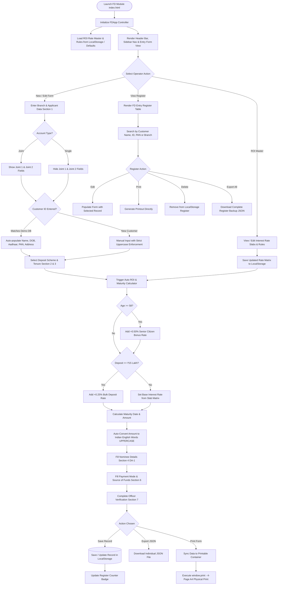
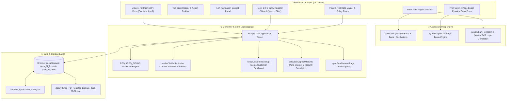

# The Junagadh Commercial Co-Operative Bank Ltd.
## Fixed Deposit (FD) Form & Register Module — Project Structure & Flowcharts

---

### 📋 Executive Summary
This document provides a comprehensive technical overview, directory manifest, component architecture breakdown, data schemas, and interactive flowcharts for **The Junagadh Commercial Co-Operative Bank Ltd. Fixed Deposit (FD) Account Opening & Register Module**.

The module is a fully standalone, zero-dependency web application designed for offline branch deployment and bank web server hosting. It features dynamic customer auto-fill, automated interest rate and maturity calculations, single/joint applicant toggling, multi-nominee DA-1 form handling, JSON database export/import, register management with search/filter capabilities, and an exact 4-page A4 physical bank application print engine.

---

## 📁 1. Project Directory Structure

Below is the clean single-folder layout of the project:

```text
FD FORM MODULE/
├── index.html                  # Core HTML single-page application (All 7 sections, sidebar, 4-page print template)
├── app.js                      # Core JavaScript controller (Form logic, calculations, storage, register, print engine)
├── styles.css                  # Master CSS stylesheet (Bank theme design system, responsive UI, 4-page A4 print CSS)
├── README.md                   # Quick operational guide in Gujarati & English for bank operators
├── PROJECT_STRUCTURE.md       # Full architecture specification, directory tree, data schemas & Mermaid flowcharts
├── assets/                     # Application visual & vector assets
│   ├── bank_emblem.js          # Vector SVG generator for official TJCCB emblem & logo placeholders
│   └── jccb-logo.png.png       # High-resolution raster bank logo image asset
├── data/                       # Sample records & database backup files
│   ├── FD_Application_7769.json               # Sample individual FD record export file
│   └── TJCCB_FD_Register_Backup_2026-09-02.json # Sample register database backup file
└── docs/                       # Regulatory & reference documentation
    └── FILED LIST.docx         # Field list specification & regulatory document
```

### 📄 File Manifest & Role Descriptions

| File / Directory | Type | Purpose & Architectural Role |
| :--- | :--- | :--- |
| [`index.html`](file:///c:/Users/ADMIN/Downloads/FD%20FORM%20MODULE-20260903T113323Z-1-001/FD%20FORM%20MODULE/index.html) | HTML5 | Main UI document containing top header, sidebar navigation, form view (7 sections), register view, ROI rate master view, and 4-page printable A4 layout. |
| [`app.js`](file:///c:/Users/ADMIN/Downloads/FD%20FORM%20MODULE-20260903T113323Z-1-001/FD%20FORM%20MODULE/app.js) | JavaScript (ES6) | Central business logic controller (`FDApp`). Manages rate matrices, maturity calculation math, English uppercase sanitization, local storage, register state, JSON export/import, and print data synchronization. |
| [`styles.css`](file:///c:/Users/ADMIN/Downloads/FD%20FORM%20MODULE-20260903T113323Z-1-001/FD%20FORM%20MODULE/styles.css) | CSS3 | Custom design system containing banking HSL/HEX color tokens, form styling, hover states, validation error highlights, and `@media print` rules for physical 4-page A4 pages. |
| [`assets/bank_emblem.js`](file:///c:/Users/ADMIN/Downloads/FD%20FORM%20MODULE-20260903T113323Z-1-001/FD%20FORM%20MODULE/assets/bank_emblem.js) | JS / SVG | High-resolution SVG vector script that injects the official bank seal ("THE JUNAGADH COMMERCIAL CO-OPERATIVE BANK LTD.", scale beam, gear teeth, "શ્રી") into placeholder elements. |
| [`assets/jccb-logo.png.png`](file:///c:/Users/ADMIN/Downloads/FD%20FORM%20MODULE-20260903T113323Z-1-001/FD%20FORM%20MODULE/assets/jccb-logo.png.png) | Image (PNG) | Bank logo raster file used for branding and external references. |
| [`data/FD_Application_7769.json`](file:///c:/Users/ADMIN/Downloads/FD%20FORM%20MODULE-20260903T113323Z-1-001/FD%20FORM%20MODULE/data/FD_Application_7769.json) | Data (JSON) | Sample exported application record used to demonstrate form import functionality. |
| [`data/TJCCB_FD_Register_Backup_2026-09-02.json`](file:///c:/Users/ADMIN/Downloads/FD%20FORM%20MODULE-20260903T113323Z-1-001/FD%20FORM%20MODULE/data/TJCCB_FD_Register_Backup_2026-09-02.json) | Data (JSON) | Sample register backup containing multiple customer deposit applications for database restoration testing. |
| [`docs/FILED LIST.docx`](file:///c:/Users/ADMIN/Downloads/FD%20FORM%20MODULE-20260903T113323Z-1-001/FD%20FORM%20MODULE/docs/FILED%20LIST.docx) | Document | Word document containing field specifications, mandatory requirements, and banking guidelines. |
| [`README.md`](file:///c:/Users/ADMIN/Downloads/FD%20FORM%20MODULE-20260903T113323Z-1-001/FD%20FORM%20MODULE/README.md) | Markdown | Concise user manual in Gujarati and English for branch operators and administrators. |
| [`PROJECT_STRUCTURE.md`](file:///c:/Users/ADMIN/Downloads/FD%20FORM%20MODULE-20260903T113323Z-1-001/FD%20FORM%20MODULE/PROJECT_STRUCTURE.md) | Markdown | This file: Comprehensive system documentation, architectural breakdown, and Mermaid flowcharts. |

---

## 📊 2. System Architecture & Workflows (Flowcharts)

### 🔄 Diagram 1: End-to-End Application Operational Workflow
The diagram below illustrates the end-to-end user operational flow from opening the application, entering applicant details, auto-calculating maturity figures, saving to local register, exporting backup files, and generating physical 4-page printouts.



---

### 🏛️ Diagram 2: High-Level Technical Architecture
The architecture follows a decoupled MVC pattern implemented entirely in vanilla JavaScript, HTML5, and CSS3 without external library build requirements:



---

### 🧮 Diagram 3: Auto Interest Rate & Maturity Calculation Flow
This diagram specifies the exact mathematical execution order for interest rates and maturity dates:

```mermaid
flowchart LR
    A[Deposit Amount & Start Date] --> B[Tenure: Days / Months / Years]
    B --> C{Total Days Conversion}
    C --> D[Lookup Rate Matrix Slab]
    
    D --> E{Applicant DOB Entered?}
    E -- Yes --> F{Age >= 58 Years?}
    F -- Yes --> G[Base Rate + 0.50% Senior Citizen Extra]
    F -- No --> H[Base Regular Rate]
    E -- No --> H

    G & H --> I{Amount >= ₹15,000,000?}
    I -- Yes --> J[Current Rate + 0.25% Bulk Extra]
    I -- No --> K[Final Effective Interest Rate]
    J --> K

    K --> L{Interest Payout Mode}
    L -- "Quarterly Payout / Monthly" --> M[Simple Interest Calculation]
    L -- "Reinvestment / Compound" --> N[Quarterly Compounded Interest: A = P(1 + r/4)^4t]

    M & N --> O[Maturity Date & Maturity Amount]
    O --> P[Convert Amount to Words: Indian Format UPPERCASE]
```

---

## 🧩 3. Detailed Component & Section Breakdown

### 📝 Form Sections in `index.html`

1. **Top Meta Header Card**: Branch selection (16 branches + HO), Form Date picker, and Form Reference/Token Number generator.
2. **Section 1: Applicant Particulars**:
   - Single / Joint mode switcher.
   - Mode of operation dropdown (Either or Survivor, Jointly, Former or Survivor, Any One or Survivor, Other).
   - Side-by-side card inputs for **First Applicant**, **Joint 1**, and **Joint 2**.
   - Customer ID auto-fill lookup (triggers instant population of Name, Address, DOB, PAN, Aadhaar, Gender, Mobile).
   - "Same Address" synchronization checkbox for Joint Applicants.
3. **Section 2: Deposit Scheme Selection**:
   - Scheme radio options: Fixed Deposit (FD), Reinvestment Deposit, Recurring Deposit (RD), Senior Citizen Special FD.
4. **Section 3: Deposit Amounts, Rates & Maturity**:
   - Support for up to 3 individual deposits under a single application.
   - Automatic interest rate determination based on tenure days/months.
   - Live maturity date computation (`formDate` + tenure).
   - Automatic conversion of numbers into words (`numberToWords`).
   - Interest payment mode selection (Quarterly Payout, Monthly, Cumulative Reinvestment, On Maturity).
   - Maturity instruction (Auto-renew Principal & Interest, Auto-renew Principal Only, Credit to Account).
5. **Section 4: Nominees Particulars (DA-1 Form)**:
   - Dynamic nominee counter (Up to 4 Nominees).
   - Fields: Name, Relationship, Age, DOB, Address, Share Percentage.
   - Automatic Minor detection (If Age < 18, Guardian Name, Address, and Relationship fields are required).
6. **Section 5: Form 15G / 15H & TDS Exemption**:
   - Declaration toggle for Senior Citizen (Form 15H) / Non-Senior (Form 15G).
   - Estimated total income and number of 15G/15H forms filed.
7. **Section 6: Mode of Payment & Source of Funds**:
   - Payment method: Cash, Cheque, Transfer from SB/CD A/c, NEFT/RTGS.
   - Account number, cheque number, date, and branch name fields.
   - Regulatory declaration for Source of Funds (Savings, Business Income, Agriculture, Property Sale, Inheritance, Other).
8. **Section 7: Officer Verification & Audit Checklist**:
   - Checkboxes for Identity Proof and Address Proof verification (Aadhaar Card, PAN Card, Passport, Voter ID, Driving License).
   - Maker Sign-off (Entered By Officer Name / Employee ID).
   - Checker Sign-off (Authorized By Officer Name / Employee ID).

---

### 🖨️ Physical 4-Page Bank Application Layout (`@media print`)

The module features a separate print DOM structure (`#printContainer`) that remains hidden during screen navigation and renders strictly on `window.print()`:

- **Page 1**: Official Bank Header, Emblem Seal, Branch Information, Account Type, Mode of Operation, Full Details for First Applicant, Joint Applicant 1, and Joint Applicant 2.
- **Page 2**: Section 2 Scheme Selection, Section 3 Deposit Matrix (Deposits 1, 2, 3 with ROI, Maturity Amount, Amount in Words), Section 5 Form 15G/15H Details, Section 6 Payment & Source of Funds.
- **Page 3**: Section 4 Nominee Details (Form DA-1 for up to 4 nominees with Minor Guardian information), Customer Signature Blocks (First, Joint 1, Joint 2).
- **Page 4**: Office Use Only Section, KYC Document Verification Matrix, Bank Maker/Checker Approval Signatures, Official Bank Rubber Stamp Seal box, and Statutory Terms & Conditions in Gujarati.

---

## 💾 4. Data Schemas & Models

### `FDRecord` Object Schema (JSON Storage Model)
```json
{
  "id": "7769",
  "formRefNo": "FD-2026-7769",
  "formDate": "2026-09-04",
  "branchName": "AZADCHOWK BRANCH (CBB)",
  "typeOfAccount": "Single",
  "modeOfOperation": "Either or Survivor",
  "customerName": "RAMESHBHAI KANJIBHAI PATEL",
  "firstApplicant": {
    "customerId": "CUST-1001",
    "title": "MR.",
    "fullName": "RAMESHBHAI KANJIBHAI PATEL",
    "fatherHusbandName": "KANJIBHAI PATEL",
    "address": "12, SHIVAM COMPLEX, OPP. ST BUS STAND, JUNAGADH - 362001",
    "mobileNo": "9876543210",
    "dob": "1965-08-15",
    "gender": "Male",
    "panNo": "ABCDE1234F",
    "aadharNo": "123456789012"
  },
  "deposit1": {
    "scheme": "Fixed Deposit (FD)",
    "amount": "500000",
    "amountWords": "FIVE LAKH RUPEES ONLY",
    "years": "1",
    "months": "0",
    "days": "0",
    "rateOfInterest": "7.25",
    "maturityDate": "2027-09-04",
    "maturityAmount": "537250"
  },
  "nominees": [
    {
      "name": "SAVITABEN RAMESHBHAI PATEL",
      "relation": "WIFE",
      "age": "54",
      "share": "100"
    }
  ],
  "payment": {
    "mode": "Cheque",
    "source": "SAVINGS / SALARY",
    "chequeNo": "452101",
    "chequeDate": "2026-09-04"
  },
  "audit": {
    "enteredBy": "EMP-8841 (MAKER)",
    "authorizedBy": "EMP-1002 (CHECKER)",
    "status": "Verified & Authorized"
  }
}
```

---

## 🚀 5. How to Run & Maintain

1. **Local Offline Execution**:
   - Double-click [`index.html`](file:///c:/Users/ADMIN/Downloads/FD%20FORM%20MODULE-20260903T113323Z-1-001/FD%20FORM%20MODULE/index.html) in any modern web browser (Google Chrome, Microsoft Edge, Mozilla Firefox).
   - No server, Node.js, or internet connection required.

2. **Bank Web Server Hosting**:
   - Deploy the entire `FD FORM MODULE` directory to your web server root (IIS / Nginx / Apache / Tomcat).
   - All relative asset paths (`assets/bank_emblem.js`, `styles.css`, `app.js`) work out-of-the-box.

3. **Backup & Database Management**:
   - **Export**: Click **Data Backup > Export** to download all saved entries as a JSON file.
   - **Import**: Click **Data Backup > Import** to restore records from a backup JSON file (e.g., [`data/TJCCB_FD_Register_Backup_2026-09-02.json`](file:///c:/Users/ADMIN/Downloads/FD%20FORM%20MODULE-20260903T113323Z-1-001/FD%20FORM%20MODULE/data/TJCCB_FD_Register_Backup_2026-09-02.json)).

---
*Documentation maintained for **The Junagadh Commercial Co-Operative Bank Ltd.** — Fixed Deposit Module Version 2.0*
